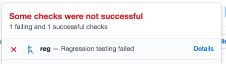
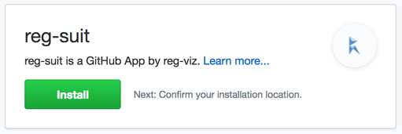
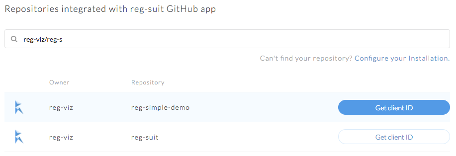

# reg-notify-github-plugin

reg-suit plugin to send notification the testing result to your GitHub repository.

Installing this plugin, reg-suit comments to your PR and sets commits' status.




## Install

```sh
npm i reg-notify-github-plugin -D
reg-suit prepare -p notify-github
```

## GitHub App and Client ID

To configure notify-github plugin, a client ID of your repository is needed. You can get the client ID via the following steps:

1. Open https://github.com/apps/reg-suit and click "Install" button.  
   
1. Select repositories to integrate with reg-suit.
1. After installation app, visit [here](https://reg-viz.github.io/gh-app/) and click the **Get client ID** button of the repository you want to integrate.  
   

## How to set commit status succeed

If reg-suit detects visual differences, it set the commit status failure. Sometimes you might dislike it because the difference is as you intended. In these cases, your reviewer can set the status green with submitting "Approve Review Changes".

## Configure

```ts
{
  clientId: string;
  prComment?: boolean;
  prCommentBehavior?: "default" | "once" | "new";
  setCommitStatus?: boolean;
}
```

- `clientId` - _Required_ - Client ID for reg-suit GitHub app. You can get it visiting [here](https://reg-viz.github.io/gh-app/) and click the **Get client ID** button.
- `prComment` - _Optional_ - Whether to allow reg-suit to comment to pull request. Default: `true`.
- `prCommentBehavior` - _Optional_ - How the plugin comments to your pull requests. Enabled values are the following. Default: `default`.
  - `"default"` : Update the PR comment if exists. Otherwise post new comment.
  - `"new"` : Delete existing old comment and post new comment.
  - `"once"` : Does nothing if the PR comment exists.
- `setCommitStatus` - _Optional_ - Whether to allow reg-suit to set commit status to fail if any visual differences are detected. Default: `true`.
