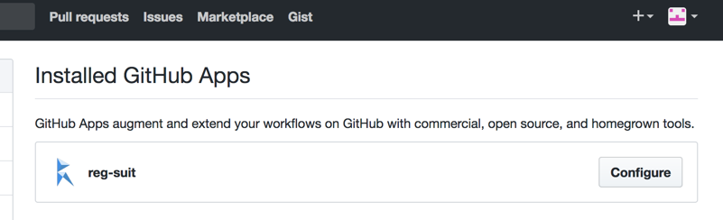

# reg-notify-github-plugin
reg-suit plugin to send notification the testing result to your GitHub repository.

Installing this plugin, reg-suit comments to your PR and sets commits' status.


## Install

```sh
npm i reg-notify-github-plugin -D
reg-suit prepare -p notify-github
```

## GitHub App and Installation ID

1. Open https://github.com/apps/reg-suit and click "Install" button.  

1. Select repositories to integrate with reg-suit.
1. After install successfully, your browser displays URL with your installation ID such as `https://github.com/settings/installations/12345`. reg-notify-github-plugin needs the installation ID. So copy it into clipboard.

If you forget your installation ID or re-install reg-suit GitHub app, you can confirm your installation ID visiting https://github.com/settings/installations and click "Configure" button.



## How to set commit status succeed
If reg-suit detects visual differences, it set the commit status failure. Sometimes you might dislike it because the difference is as you intended. In these cases, your reviewer can set the status green with submitting "Approve Review Changes".

## Configure

```ts
{
  owner: string;
  repository: string;
  installationId: string;
  prComment?: boolean;
}
```

- `owner` - *Required* - Owner name of the repository.
- `repository` - *Required* - Name of the repository.
- `installationId` - *Required* - Installation ID of reg-suit GitHub app. You can get it visiting [here](https://github.com/settings/installations) and click the **Configure** link.
- `prComment` - *Optional* - Whether to allow reg-suit to comment to pull request. Default: `true`.
